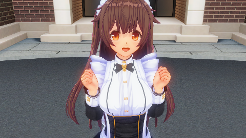
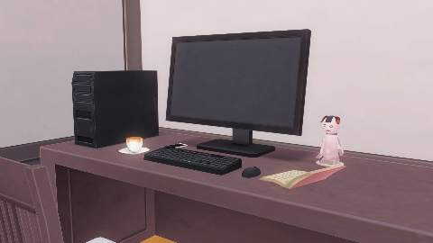
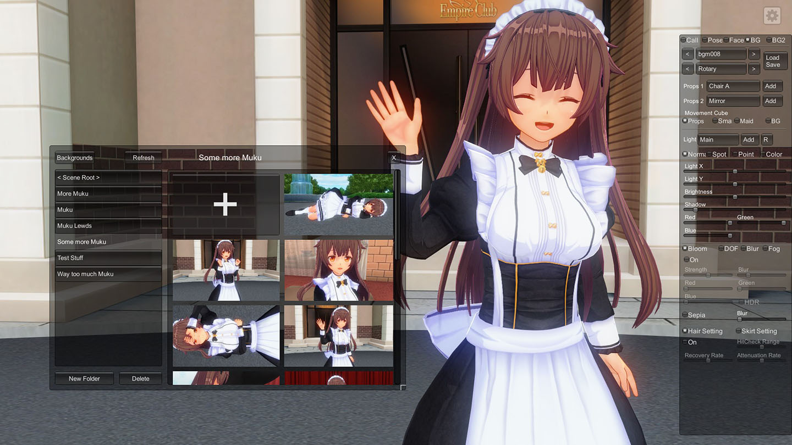

# MultipleMaids.PngSceneSave

Converts MultipleMaid.ini saves to images that have scene data in them and vice versa.

## Building

`ExIni.dll` is required. Place it in `/lib` folder and restore NuGet packages.

## Usage

Drag MultipleMaids.ini or already converted image files onto exe or provide them as command line arguments.

### Example Scene

### Example Kankyo (Background)

## Why Though?
You can use the converted images in [this](https://git.coder.horse/habeebweeb/modifiedMM) version of MultipleMaids which features a new save manager that uses these images.

The latest release can be found [here](https://git.coder.horse/habeebweeb/modifiedMM/releases)
